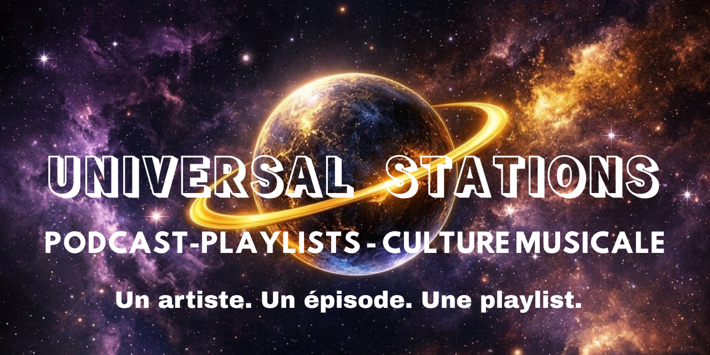

# 🎙️ Universal Stations

> **Podcast · Playlists · Culture musicale urbaine**

---

## 🌍 Le concept

**Universal Stations**, c'est le podcast qui voyage à travers les sons du monde.

Chaque épisode met en lumière un artiste, un univers, une identité musicale.
Et pour aller plus loin, chaque épisode est accompagné d'une **playlist exclusive de 10 titres** sélectionnés par ou autour de l'artiste.

Un épisode. Un artiste. Une playlist.

---

## 🎵 Les saisons

### 🟡 Saison 1 — Rap
Les voix qui font l'histoire du rap, de la rue aux sommets des charts.

### 🟣 Saison 2 — Pop
Plongée dans la pop contemporaine, de Londres à Paris en passant par Los Angeles.

### 🟢 Saison 3 — Reggae
Voyage aux racines du reggae, avec les artistes qui font vibrer la scène mondiale.

---

## 📻 Écouter le podcast

---

## 🎧 Les playlists

---

## 📲 Nous suivre

---

## 📍 Paris, France

*Universal Stations — Parce que chaque artiste mérite sa station.*
